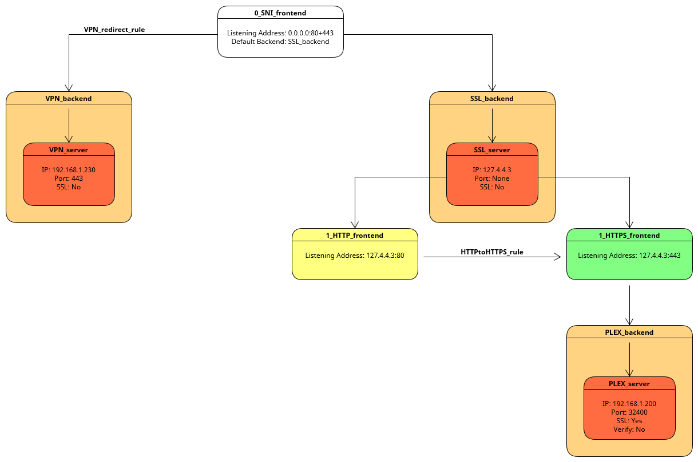

# Introduction
## What are we going to do?

1. We will install the necessary plugins.
2. We will use a free DynDNS provider (<https://desec.io/>) that supports the DNS challenge which is mandatory in order to obtain a wildcard certificate.   
If you already have your own domain and your hosting provider offers an API that is supported by the Let's Encrypt (ACME Client) plugin for OPNsense, you can use it instead.
3. We will create a wildcard SSL certificate using Let's Encrypt.
4. We will configure the necessary firewall rules and change some OPNsense settings in order for HAProxy to function properly.
5. We will use HAProxy to do SNI (explanation below) and SSL offloading.
6. We will enable access to HAProxy from the internal network.

## What will the end result look like?

We will have a wildcard SSL certificate from Let's Encrypt that gets an A+ rating with a score of 100% in each category in SSLLabs SSL Server Test.
<https://www.ssllabs.com/ssltest/>

We will also have two levels of load balancing our services.

## **Level 0 - SSL Offloading disabled**

WWW --> WAN interface --> OPNsense --> HAProxy SNI Frontend --> internal servers / services

## **Level 1 - SSL Offloading enabled**

WWW --> WAN interface --> OPNsense --> HAProxy SNI Frontend --> HAProxy SSL Frontend --> internal servers / services

## Visual Schematic
(Idea: [@cookiemonster](https://forum.opnsense.org/index.php?topic=23339.msg123295#msg123295))
