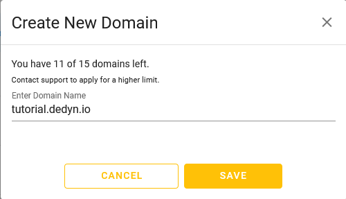

{{ $frontmatter.section }}
# Part {{ $frontmatter.chapter }} - {{ $frontmatter.chapterTitle }}

## Process

Visit <https://desec.io/domains>

-> Create your domain by clicking on the "round yellow + icon" in the top right corner.

> [!NOTE] INFO
> _Your domain has to be in the form of `<your_subdomain>.dedyn.io`._  
> _I will use `tutorial.dedyn.io` as an example._

> [!IMPORTANT] NOTICE
> Please don't get confused by the word "domain" here as you are not really creating a proper domain but actually just a subdomain of the domain `dedyn.io`.

## Reference
