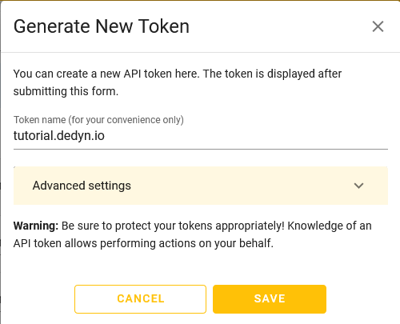

{{ $frontmatter.section }}
# Part {{ $frontmatter.chapter }} - {{ $frontmatter.chapterTitle }}

## Process

Visit https://desec.io/tokens

-> Create a token for your domain and name it accordingly.

## Reference

