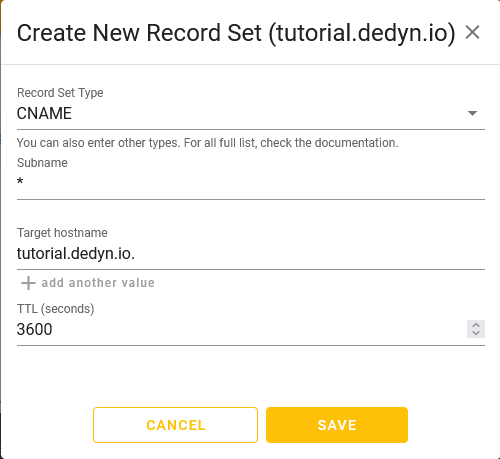

{{ $frontmatter.section }}
# Part 2.6 - CNAME Record

The next step is to add a CNAME record for your services.


> [!TIP] Note
> If you don't need or want to do this because you only have one service, just skip this step. But in my opinion it makes sense to do this as it simplifies load balancing the services with HAProxy.

You can either add an individual CNAME record per service, i.e. `plex.<your_subdomain>.dedyn.io`, `mail.<your_subdomain>.dedyn.io` and so on.

OR

You just create a single wildcard CNAME record `*.<your_subdomain>.dedyn.io` for all your services.

With the latter `<any_string>.<your_subdomain>.dedyn.io` will resolve to the IP of `<your_subdomain>.dedyn.io`.

## Process

Visit `https://desec.io/domains/<your_subdomain>.dedyn.io`.

-> Add a record by clicking on the "round yellow + icon" in the top right corner.

```text
Record Set Type:    CNAME
Subname:            * or <service_name> (i.e. plex)
Target hostname:    <your_subdomain>.dedyn.io
TTL:                3600 [default]
```

## Reference

