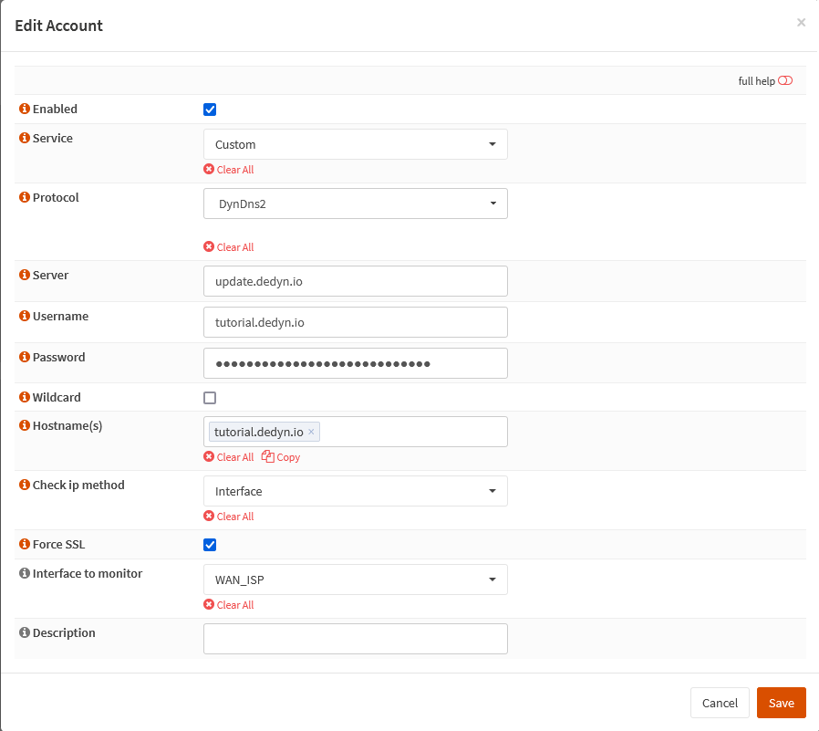

{{ $frontmatter.section }}
# Part 2.7 - OPNsense DynDNS Client

The next step is to enable DynDNS in OPNsense.

## Process

In your OPNsense GUI, Preform the following;
- Navigate to **`Services -> Dynamic DNS --> General settings`**  
  -> Check that "Enable" is checked.

<div style="margin-top: 4rem"></div>

- Navigate to **`Services --> Dynamic DNS --> Accounts`**  
  -> Click on `Add`, fill out the information accordingly, hit `Save` and then `Apply`.


```text
Enabled:        checked
Service:        custom
Protocol:       DynDns2
Server:         update.dedyn.io
Username:       <your_subdomain>.dedyn.io
Password:       <token>
Hostname(s):    <your_subdomain>.dedyn.io
```

## Reference

