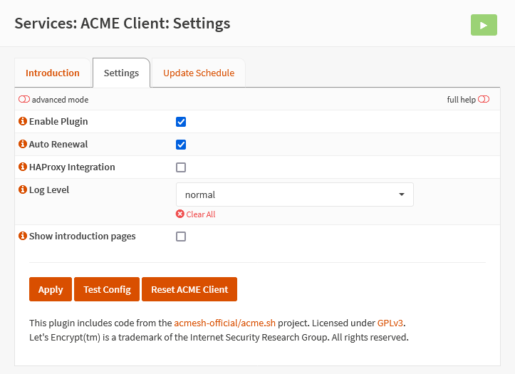

{{ $frontmatter.section }}
# Part 3.1 - Settings

## Process

In your OPNsense GUI, Preform the following;

- Navigate to **`Services --> ACME Client --> Settings`**

> [!IMPORTANT] NOTE
> We don't need the HAProxy integration as we are obtaining our certificates using the DNS challenge.

<div style="margin-top: 4rem"></div>

-> Update the settings to the following.
 
```text
Enable Plugin:              checked
Auto Renewal:               checked
HAProxy Integration:        unchecked
Log Level:                  normal
Show introduction pages:    unchecked
```

## Reference
