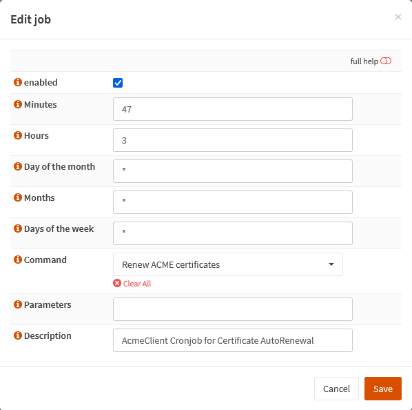

{{ $frontmatter.section }}
# Part 3.2 - Schedule

Here we will configure at which time of the day our certificates are renewed.

They won't be renewed everyday as the ACME client will first check if the certificates are close to expiration and if they are not they won't get renewed.

You want this to happen at a time of the day where there is not much load on your services as the ACME plugin restarts HAProxy so it can use your new certificates which results in a very short downtime of HAProxy.

> [!WARNING]
> You will also want this to NOT happen at any full hours (f.e. 3 am) because these are times when the servers of Let's Encrypt could be so busy that your certificate renewal fails.

## Process

In your OPNsense GUI, Preform the following;

- Navigate to **`Services --> ACME Client --> Settings --> Update Schedule`**  
-> Update the settings to the following.

```text
Enabled:            checked
Minutes:            47
Hours:              3
Day of the Month:   *
Months:             *
Days of the week:   *
Command:            Renew ACME certificates
Parameters:         
Description:        AcmeClient Cronjob for Certificate AutoRenewal
```

## Reference
