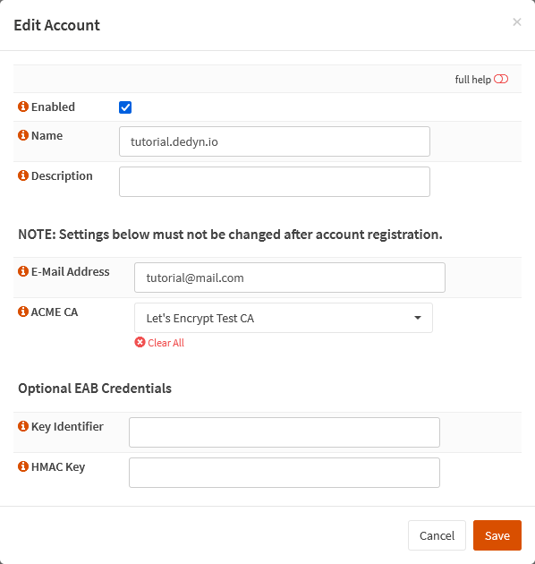

{{ $frontmatter.section }}
# Part {{ $frontmatter.chapter }} - {{ $frontmatter.chapterTitle }}

Create a new account. You can name it whatever you like, I usually use the domain name (if it is a real domain) or in this case the FQDN.

> [!WARNING] Before We Begin
> We will want to use the staging environment `Let's Encrypt Test CA` for now.
> <https://letsencrypt.org/docs/staging-environment/>

## Process

In your OPNsense GUI, Preform the following;

- Navigate to **`Services --> ACME Client --> Accounts`**  
    -> Create a new account and use the following settings.

```text{5}
Enabled:         checked
Name:            <your_subdomain>.dedyn.io

E-Mail Address:  <your_email>
ACME CA:         Let's Encrypt Test CA  <-- IMPORTANT // [!code warning]
```

## Reference

