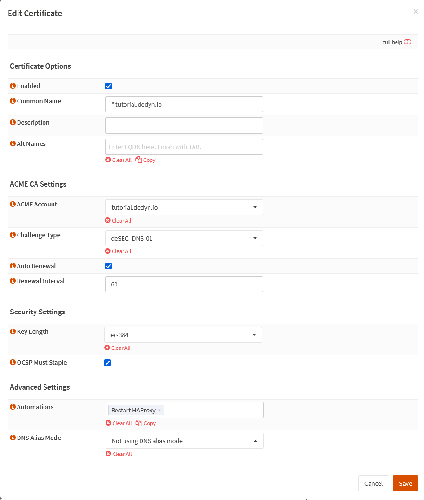

{{ $frontmatter.section }}
# Part {{ $frontmatter.chapter }} - {{ $frontmatter.chapterTitle }}

Create the certificate for your domain.

> [!TIP] Note
> I prefer to use Elliptic Curve Cryptography (ECC). (<https://en.wikipedia.org/wiki/Elliptic-curve_cryptography>)  
> But you can of course also use RSA keys just make sure to set the key length as high as possible in order to get an A+ rating from SSLLabs.

## Process

In your OPNsense GUI, Preform the following;

- Navigate to **`Services --> ACME Client --> Certificates`**  
  -> Create a new certificate for your domain and use the following settings.

```text
Enabled:             checked
Common Name:         *.<your_subdomain>.dedyn.io

ACME Account:        <account created in part 3.3>
Challenge Type:      <challenge type created in part 3.5>
Auto Renewal:        checked
Renewal Interval:    60

Key Length:          ec-384
OCSP Must Staple:    checked

Automations:        Restart HAProxy <automation created in part 3.4>
```


## Reference

