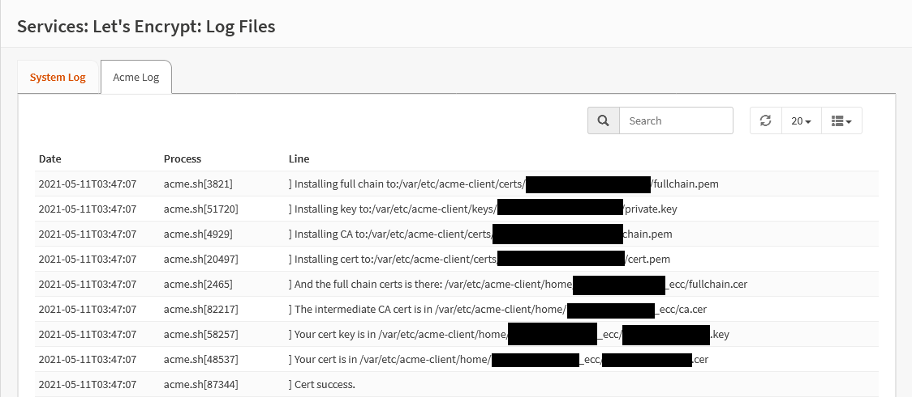

{{ $frontmatter.sectionTitle }}
# Part 3.8 - ACME Log

Let's check if your certificate has been issued successfully.

## Process

In your OPNsense GUI, Preform the following;
- Navigate to **`Services --> ACME Client --> Log Files --> ACME Log`**

If your certificate is issued successful your log should look similiar to the [reference](#reference) and you can proceed.

> [!WARNING] Errors Occurred
> If your logs don't show success, go back and check your configuration.

## Reference

