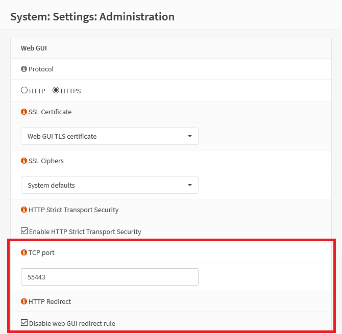

{{ $frontmatter.sectionTitle }}
# Part 4.1 - Administration

You only need to check "Disable web GUI redirect rule" and change the "Web GUI TCP port" to a custom one.

Otherwise, HAProxy will not function correctly as you will probably want to access your services from the WWW using the default HTTPS port (TCP 443).

## Process

In your OPNsense GUI, Preform the following;

- Navigate to **`System --> Settings --> Administration`**  
    -> Update the settings to the following.
 
```text
TCP port:       55443 <or other port of your choice>
HTTP Redirect:  checked  <disable web GUI redirect rule>

```

## Reference
