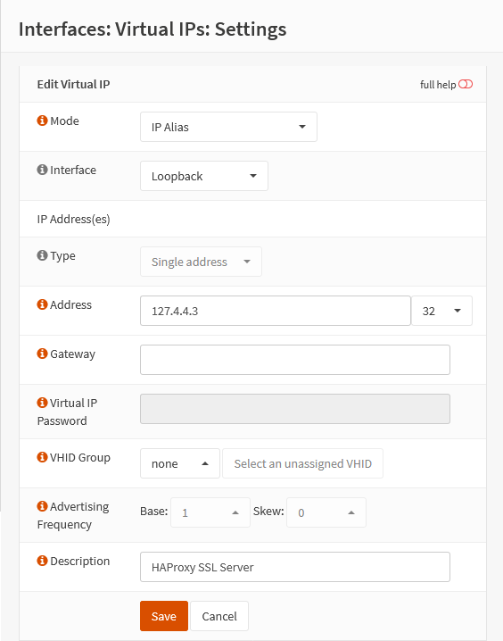

{{ $frontmatter.section }}
# Part 4.2 - Virtual IP

> [!NOTE] OPTIONAL
> This step is optional, see [FAQ](/faq). You can safely skip this step and use the localhost instead for your `SSL_server`.

If you would like to do it my way then you will need to create a virtual IP that is in a different subnet than any of your other networks.

Preferably you would choose an IP that belongs to the localhost subnet in order to avoid IP conflicts in your local network. (<https://en.wikipedia.org/wiki/Localhost>)

In this tutorial `127.4.4.3/32` is going to be the IP on which the `HTTP_frontend` and `HTTPS_frontend` will be listening on.

## Process

In your OPNsense GUI, Preform the following;

- Navigate to **`Interfaces --> Virtual IPs --> Settings`**  
    -> Create a new Virtual IP and assign the following settings.

```text
Mode:           IP Alias
Interface:      Loopback
Address:        127.4.4.3/32
Description:    HAProxy SSL Server
```

## Reference
