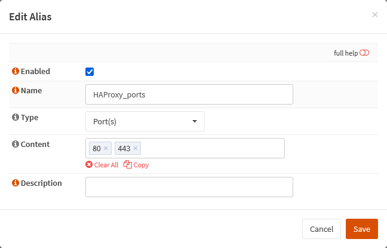

{{ $frontmatter.sectionTitle }}
# Part 4.3 - Aliases

Now we are going to create an alias for the ports that HAProxy will be listening on.
In most setups you will probably need at least 80 and 443.

## Process

In your OPNsense GUI, Preform the following;

- Navigate to **`Firewall --> Aliases`**  
    -> Create a new alias and assign the following settings.

```text
Enabled:    checked
Name:       HAProxy_ports
Type:       Port(s)
Content:    80 443
```

## Reference

