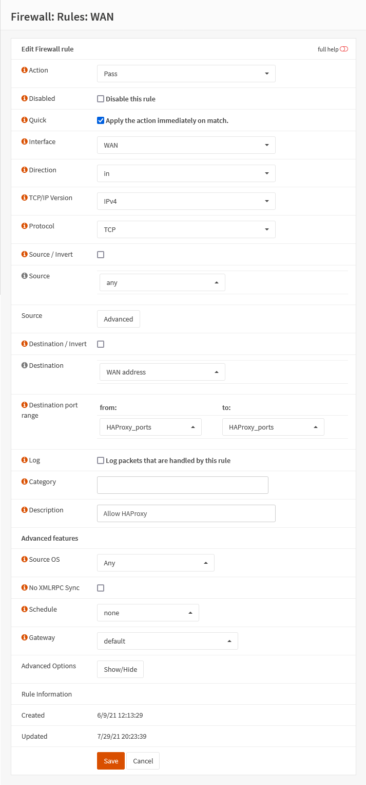

{{ $frontmatter.section }}
# Part 4.4 - Firewall (WAN)

We are going to allow any inbound traffic hitting our WAN interface on the ports specified in the `HAProxy_ports` alias.

## Process

In your OPNsense GUI, Preform the following;

- Navigate to **`Firewall --> Rules --> WAN`**  
  -> Create a new firewall rule and assign the following settings.

```text
Action:             Pass
Interface:          WAN
Protocol:           TCP

Destination:        WAN address
Destination Port
    From:           HAProxy_ports
    To:             HAProxy_ports
    
Description:        Allow HAProxy
```


## Reference

