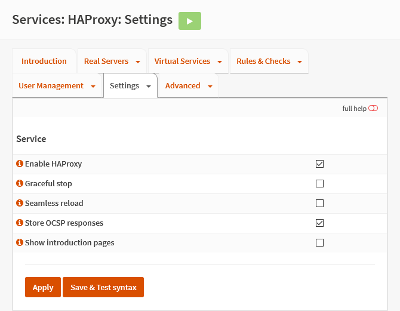

{{ $frontmatter.sectionTitle }}
# Part 5.1 - Service

## Process

In your OPNsense GUI, Preform the following;

- Navigate to **`Services --> HAProxy --> Settings --> Service`**  
    -> Update the settings to the following.
 
```text{1,4}
Enable HAProxy:             checked
Graceful stop:              unchecked
Seamless reload:            unchecked
Store OCSP responses:       checked
Show introduction pages:    unchecked
```

## Reference
