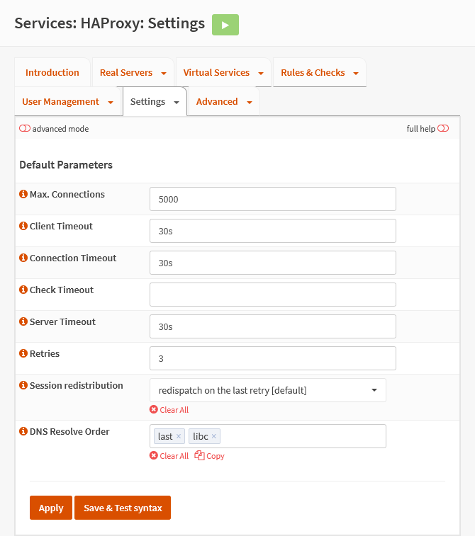

{{ $frontmatter.sectionTitle }}
# Part 5.3 - Default Parameters

## Process

In your OPNsense GUI, Preform the following;

- Navigate to **`Services --> HAProxy --> Settings --> Default Parameters`**  
    -> Update the settings to the following.

```text
Maximum Connection:         5000
Client Timeout:             30s
Connection Timeout:         30s
Check Timeout:
Server Timeout:             30s
Retries:                    3
Session redistribution:     redispatch on last retry [default]
DNS Resolve Order:          last libc   
```

## Reference

