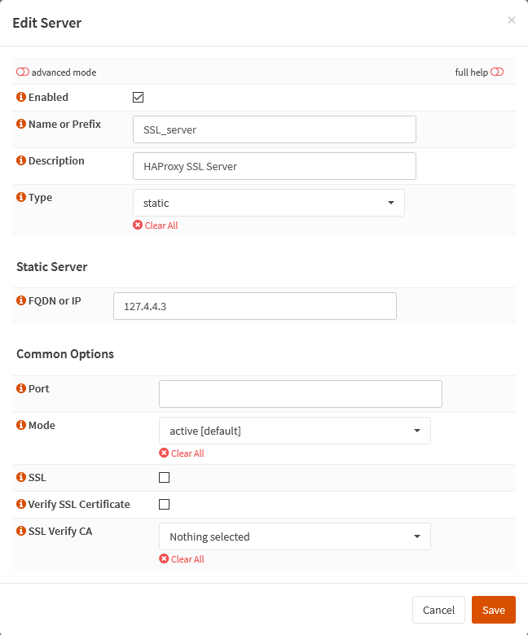

{{ $frontmatter.sectionTitle }}
# Part 5.4 - Real Servers

First we will add our `SSL_server` using our [virtual IP](../part-4/002-opnsense-virtual-ip) (or localhost IP if you wish) to do the SSL offloading.

Then you can add all your other services according to their individual configuration.
## Process - `SSL_Server`

In your OPNsense GUI, Preform the following;

- Navigate to **`Services --> HAProxy --> Settings --> Real Servers`**  
    -> Create a new server and assign the following settings.

```text
Enabled:                    checked
Name or Prefix:             SSL_server
Description:                HAProxy SSL Server
Type:                       static

FQDN or IP:                 127.3.3.4

Port:                       
Mode:                       active [default]
SSL:                        unchecked   
SSL SNI:                    
Verify SSL Certificate:     unchecked
SSL Verify CA:              nothing selected
```

## Process - `HTTP_Server`

In your OPNsense GUI, Preform the following;

- Navigate to **`Services --> HAProxy --> Settings --> Real Servers`**  
    -> Create a new server and assign the following settings.

```text
Enabled:                    checked
Name or Prefix:             PLEX_server
Description:                Plex Media Server
Type:                       static

FQDN or IP:                 <your_plex_ip_address>

Port:                       <your_plex_port> [32400]
Mode:                       active [default]
<Use if you server expects or accepts SSL traffic internally> // [!code warning]
SSL:                        checked     // [!code warning]
SSL SNI:                    
Verify SSL Certificate:     unchecked
SSL Verify CA:              nothing selected
```

## Reference



