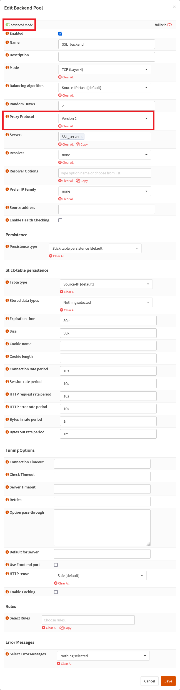
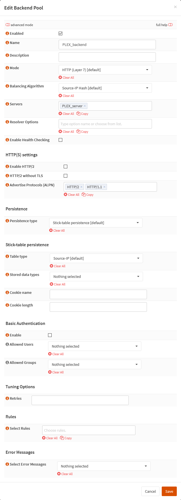

{{ $frontmatter.sectionTitle }}
# Part 5.5 - Backend Pools

Here we first create our `SSL_backend`. This is the backend to which our `SNI_frontend` sends most of its traffic to.

As you can't mix HTTP mode and TCP mode in a frontend to backend relation, make sure that the `SSL_backend` is set to TCP mode since our `SNI_frontend` is also running in TCP mode.

Then we create the backend that belongs to an actual service. _**You will need one backend for each service**_.

> [!NOTE] 
> If you have multiple servers serving the exact same content than you will want to add all servers into a single backend so HAProxy can actually balance the load between the servers.

## Process - `SSL_Server`

In your OPNsense GUI, Preform the following;

- Navigate to **`Services --> HAProxy --> Settings --> Virtual Services --> Backend Pools`**  
  -> Create a new backend and assign the following settings.

```text
** Enable advanced mode **
Enabled:                    checked
Name:                       SSL_backend
Description:                
Mode:                       TCP (Layer 4)
Random Draws:               2
Proxy Protocol:             Version 2
Servers:                    SSL_server
Enable Health Checking:     unchecked 
```

## Process - `HTTP_Server`

In your OPNsense GUI, Preform the following;

- Navigate to **`Services --> HAProxy --> Settings --> Virtual Services --> Backend Pools`**  
  -> Create a new backend and assign the following settings.

```text
Enabled:                    checked
Name:                       PLEX_backend
Description:                
Mode:                       HTTP (Layer 7) [default]
Servers:                    PLEX_server
Enable Health Checking:     unchecked 

Enable HTTP/2               unchecked
```

## Reference



