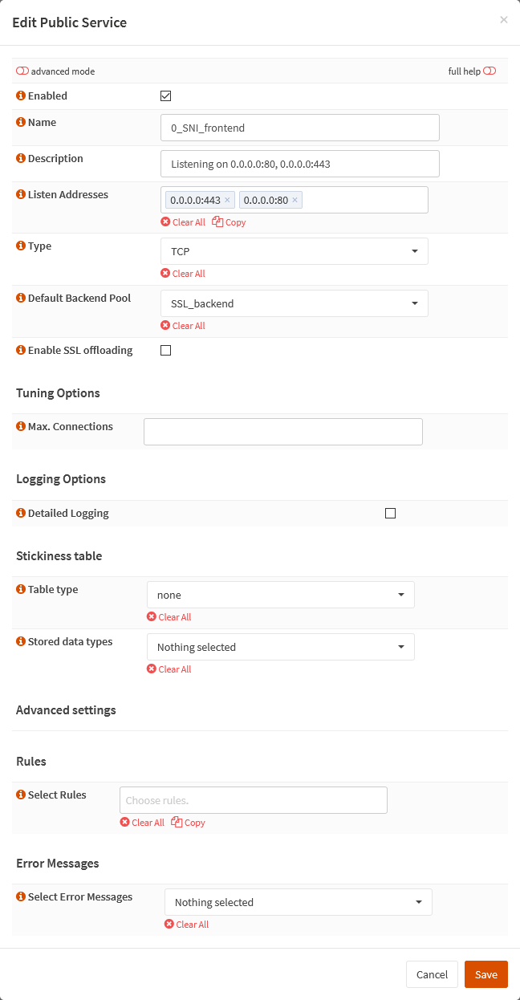
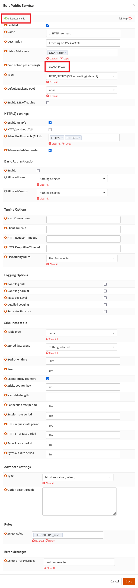

{{ $frontmatter.sectionTitle }}
# Part 5.9 - Public Services

Here we will create the frontends that are listening on our interface IPs and the [virtual IP](../part-4/002-opnsense-virtual-ip) we created earlier.

First, we will create our [`SNI_frontend`](#process---sni_frontend) which will decide weather the traffic is going to be SSL offloaded or not.

Second, we will create our [`HTTP_frontend`](#process---http_frontend)

Lastly, we will create our [`HTTPS_frontend`](#process---https_frontend).

## Process - `SNI_frontend`

You will have to place the rules for all of your services that you don't want to get SSL offloaded in here.

Our default backend in this frontend will be the `SSL_backend` that redirects all traffic to our virtual `SSL_server` which is actually our `HTTPS_frontend`.

In your OPNsense GUI, Preform the following;

- Navigate to **`Services --> HAProxy --> Settings --> Virtual Services --> Public Services`**  
  -> Create a frontend service and assign the following settings.

```text
Enabled:                checked
Name:                   0_SNI_frontend
Description:            Listening on 0.0.0.0:80, 0.0.0.0:443
Listen Addresses:       0.0.0.0:80 0.0.0.0:443
Type:                   TCP
Default Backend Pool:   SSL_backend
Enable SSL offloading:  unchecked
```

## Process - `HTTP_frontend`

Make sure to place the `HTTPtoHTTPS_rule` in this frontend!

This frontend is necessary in order to redirect HTTP traffic to HTTPS. But you could also use it to serve non SSL encrypted services on port 80.

In your OPNsense GUI, Preform the following;

- Navigate to **`Services --> HAProxy --> Settings --> Virtual Services --> Public Services`**  
  -> Create a frontend service and assign the following settings.

```text
** Enable advanced mode **
Enabled:                    checked
Name:                       1_HTTP_frontend
Description:                Listening on 127.4.4.3:80
Listen Addresses:           127.4.4.3:80
Bind option pass-through:   accept-proxy
Type:                       HTTP/HTTPS (SSL offloading) [default]
Default Backend Pool:       None
Enable SSL offloading:      unchecked

Enable HTTP/2:              checked
X-Forwarded-For             checked

Select Rules:               HTTPtoHTTPS_rule
```

## Process - `HTTPS_frontend`

This will be our primary frontend which is doing the SSL offloading using our earlier created Let's Encrypt certificate.

You will have to place the `PUBLIC_SUBDOMAINS_rule` and all other rules of your services that you want to get SSL offloaded in here.

> [!WARNING] Cipher List & Cipher Suites
> Don't forget to change the "Cipher List" and "Cipher Suites" with the ones found [here](/guides/haproxy/current-ciphers){target: '_blank'}.

In your OPNsense GUI, Preform the following;

- Navigate to **`Services --> HAProxy --> Settings --> Virtual Services --> Public Services`**  
  -> Create a frontend service and assign the following settings.

```text
** Enable advanced mode **
Enabled:                    checked
Name:                       1_HTTPS_frontend
Description:                Listening on 127.4.4.3:443
Listen Addresses:           127.4.4.3:443
Bind option pass-through:   accept-proxy
Type:                       HTTP/HTTPS (SSL offloading) [default]
Default Backend Pool:       None
Enable SSL offloading:      checked

Certificates:               <your_subdomain>.dedyn.io (ACME Client)
SSL option pass-through:    curves secp384r1
Enable Advanced settings:   checked

Minimum SSL Version:        None
Maximum SSL Version:        None
Cipher List:                <see above ciper list> // [!code warning]
Cipher Suites:              <see above ciper suites> // [!code warning]
Enable HSTS:                checked
HSTS includeSubDomains:     checked
HSTS preload:               checked
HSTS max-age:               63072000
Bind options:               no-sslv3 no-tlsv10 no-tlsv11 no-tls-tickets

Enable HTTP/2:              checked
X-Forwarded-For             checked

Select Rules:               PUBLIC_SUBDOMAINS_rule
```

## Reference






