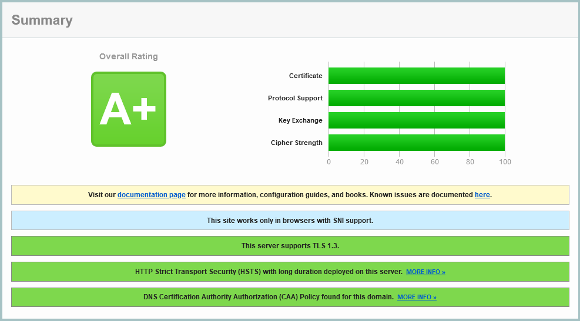

{{ $frontmatter.sectionTitle }}
# Part 5.10 - Conclusion

Access from external networks should now already be working.

Just try to access your URL `<your_service>.<your_subdomain>.dedyn.io` from any device that is not connected to your local network, i.e. a smartphone on cellular data.

## Process

You can now also verify your SSL settings;  
Visit https://www.ssllabs.com/ssltest/

If you configured everything in HAProxy and the ACME Client according to my template you should get an A+ rating with a score of 100% in each category.

## Reference
