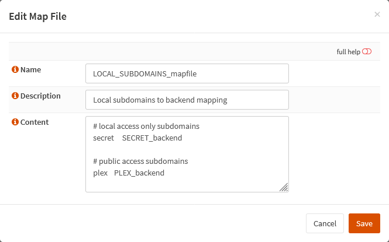

{{ $frontmatter.sectionTitle }}
# Part 7.1 - Map Files

Here you need to clone the `PUBLIC_SUBDOMAINS_mapfile`, rename it to `LOCAL_SUBDOMAINS_mapfile` and add all your local-access-only subdomains along with their corresponding backends.

Keep in mind that the content of your `PUBLIC_SUBDOMAINS_mapfile` also has to be put in the `LOCAL_SUBDOMAINS_mapfile`! I will explain why later.

## Process

In your OPNsense GUI, Preform the following;

- Navigate to **`Services --> HAProxy --> Settings --> Advanced --> Map Files`**  
    -> Clone the `PUBLIC_SUBDOMAINS_mapfile` and assign the following settings.

```text
Name:               LOCAL_SUBDOMAINS_mapfile
Description:        Local subdomains to backend mapping

Content:            # local access subdomains
                    secret  SECRET_backend
                    
                    # public access subdomains
                    plex    PLEX_backend
```

## Reference
