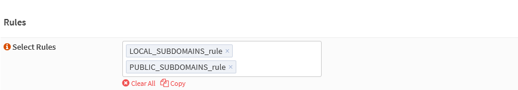

{{ $frontmatter.sectionTitle }}
# Part 7.4 - Public Services

The last thing left to do is to place the `LOCAL_SUBDOMAINS_rule` before your `PUBLIC_SUBDOMAINS_rule` in your `HTTPS_frontend`.

## Process

> [!CAUTION] ATTENTION!
> Remember that I told you to also put the content of your `PUBLIC_SUBDOMAINS_mapfile` in the `LOCAL_SUBDOMAINS_mapfile`?  
>
> This is because HAProxy is processing the rules in the frontends based on the order they appear!  
>
> So if you place your `PUBLIC_SUBDOMAINS_rule` before your `LOCAL_SUBDOMAINS_rule` in the frontend configuration, you won't get access to your local-access-only subdomains.  
>
> Vice versa this will also happen and you will no longer have access to your public subdomains.  
>
> To avoid this you have to also put the content of your `PUBLIC_SUBDOMAINS_mapfile` in the `LOCAL_SUBDOMAINS_mapfile` and place their rules in the correct order.  

In your OPNsense GUI, Preform the following;

- Navigate to **`Services --> HAProxy --> Settings --> Virtual Services --> Public Services`**  
  -> Edit the `HTTPS_frontend` service and assign the following settings.

```text
----
Select Rules:    PUBLIC_SUBDOMAINS_rule // [!code --]
Select Rules:    LOCAL_SUBDOMAINS_rule PUBLIC_SUBDOMAINS_rule // [!code ++]
----
```


## Reference

