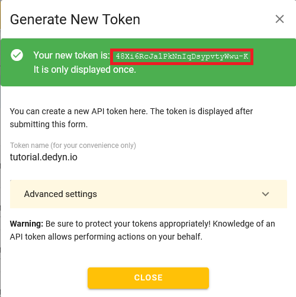

{{ $frontmatter.sectionTitle }}
# Part 2.4 - Save Token

Save the token somewhere secure as we will need it twice during this tutorial and you also might need it again in the future.

This token will allow the DynDNS service and the Let's Encrypt plugin of your OPNsense to authenticate to the API of deSEC.

## Process

-> Copy the given token and save it somewhere secure for future reference.

## Reference

