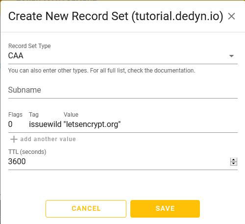

{{ $frontmatter.sectionTitle }}
# Part 2.5 - CAA Record

Add a CAA record containing the information on which certification authority (CA) is allowed to issue SSL certificates for your domain.

> [!IMPORTANT] NOTE
> This is important in order to get an A+ rating from SSLLabs.

## Process

Visit `https://desec.io/domains/<your_subdomain>.dedyn.io`. 

-> Add a record by clicking on the "round yellow + icon" in the top right corner.

```text
Record Set Type:    CAA
Tag:                issuewild
Value:              "letsencrypt.org"
TTL:                3600 [default]
```

## Reference

