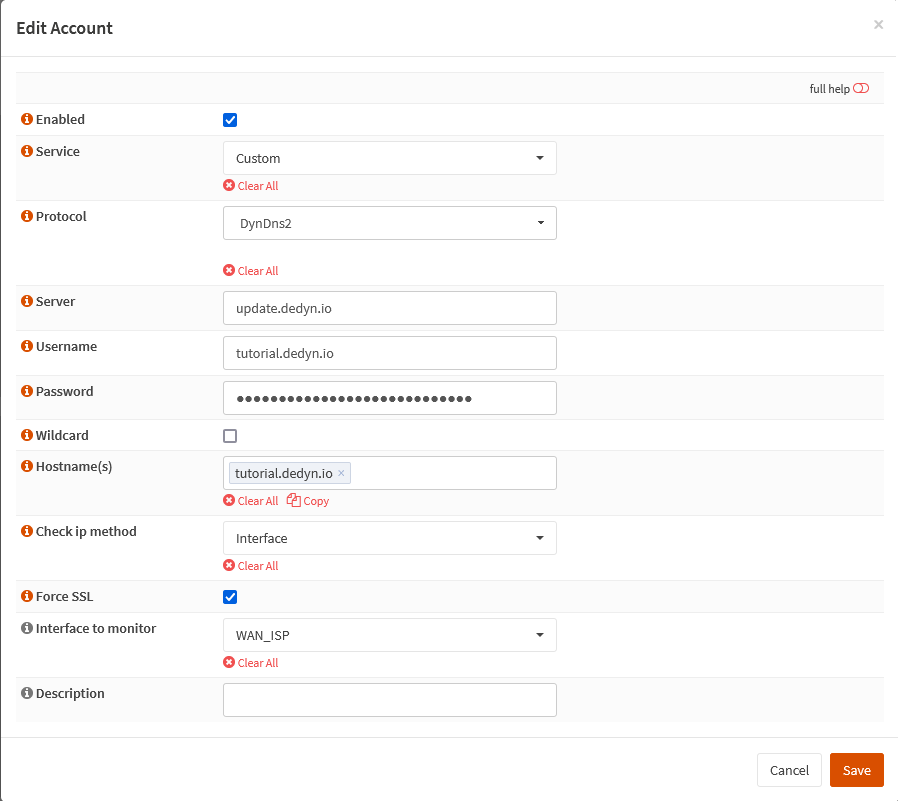

{{ $frontmatter.sectionTitle }}
# Part 2.8 - Conclusion

If everything went right `<your_subdomain>.dedyn.io` and `<any_string>.<your_subdomain>.dedyn.io` should resolve to your public IP.

Now that we have our DynDNS provider all set up we will want to obtain our SSL certificate.

## Process

To test this in your OPNsense GUI,
- Navigate to **`Interfaces --> Diagnostics --> Ping`**

> [!WARNING] NOTE
> If it doesn't work wait a few minutes as it can take some time before all the DNS providers around the world have your hostname in their database.

> [!CAUTION]
> If it still doesn't work after some time, check your configuration.

## Reference

