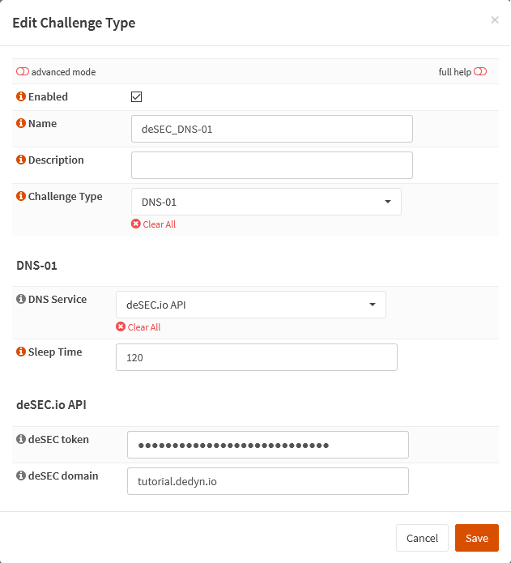

{{ $frontmatter.sectionTitle }}
# Part 3.5 - Challenge Types

Create the Challenge Types for ACME Client to verify your domain.

## Process

In your OPNsense GUI, Preform the following;

- Navigate to **`Services --> ACME Client --> Challenge Types`**  
  -> Create a new challenge type and use the following settings.

```text
Enabled:            checked
Name:               deSEC_DNS-01
Challenge Type:     DNS-01

DNS Service:        deSEC.io API
Sleep Time:         120

deSEC token:        <token>
deSEC domain:       <your_subdomain>.dedyn.io
```

## Reference

