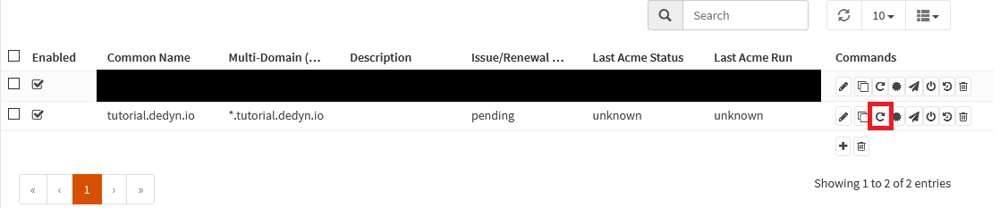

{{ $frontmatter.sectionTitle }}
# Part 3.7 - Test Certificate

We need to forcefully issue our staging certificate so we can test things out and don't have to wait for the next update schedule.

## Process

In your OPNsense GUI, Preform the following;
- Navigate to **`Services --> ACME Client --> Certificates`**  
  -> Click the button indicated in the [reference](#reference) below.

## Reference

