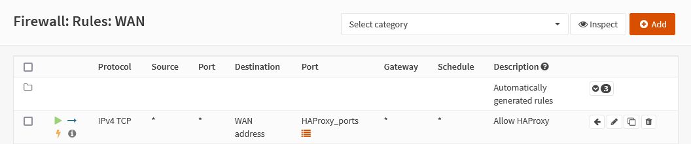

{{ $frontmatter.sectionTitle }}
# Part 4.5 - Conclusion

If you did it right it should look like this, make sure that the rule is above all other rules in the list.

Now we can finally configure HAProxy and make our services available on WAN.