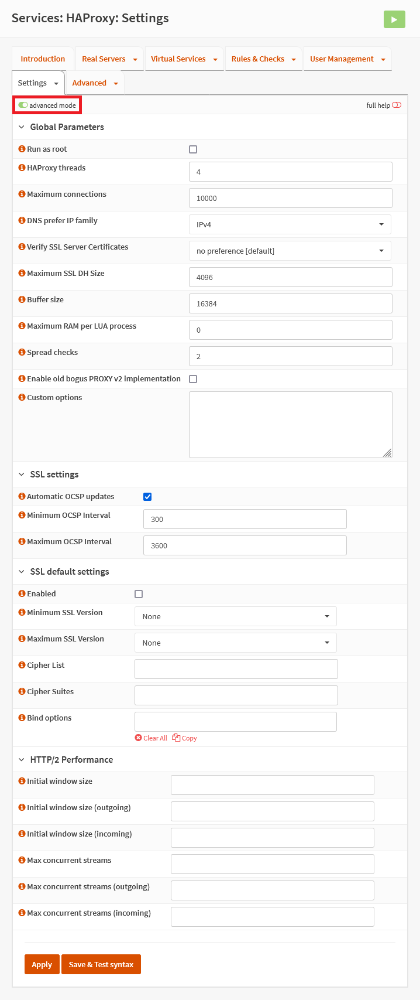

{{ $frontmatter.sectionTitle }}
# Part 5.2 - Global Parameters

As our certificate has the OCSP Must Staple extension we need to update HAProxy's OCSP data regularly. If we don't do this clients connecting to our services will get security warnings or won't connect at all.

> [!WARNING] CAUTION
> The number of HAProxy threads should not exceed the number of CPU threads of your OPNsense.

## Process

In your OPNsense GUI, Preform the following;

- Navigate to **`Services --> HAProxy --> Settings --> Global Parameters`**  
    -> Update the settings to the following.

```text
** Enable advanced mode **
HAProxy threads:            4
Maximum connections:        10000
Maximum SSL DH Size:        4096
Buffer size:                16384
Spread checks:              2

Automatic OCSP updates:     checked
Minimum OCSP Interval:      300
Maximum OCSP Interval:      3600   

SSL Enabled:                unchecked
Minimum SSL Version:        none
Maximum SSL Version:        none
```

## Reference
