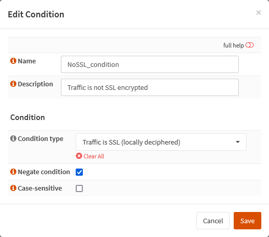

{{ $frontmatter.sectionTitle }}
# Part 5.6 - Conditions

Here we will only create a "NoSSL_condition", which is necessary in order to identify non-HTTPS traffic.

## Process

In your OPNsense GUI, Preform the following;

- Navigate to **`Services --> HAProxy --> Settings --> Rules & Checks --> Conditions`**  
  -> Create a new condition and assign the following settings.

```text
Name:               NoSSL_condition
Description:        Traffic is not SSL encrypted

Condition type:     Traffic is SSL (locally deciphered)
Negate condition:   checked // [!code warning]
Case-sensitive:     unchecked
```


## Reference

