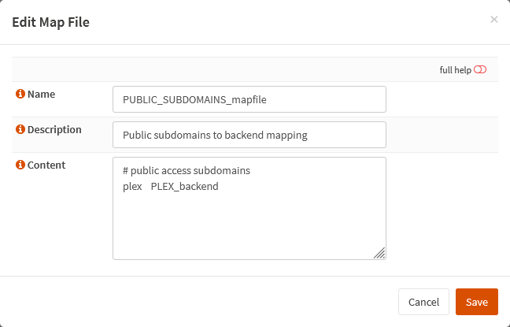

{{ $frontmatter.sectionTitle }}
# Part 5.7 - Map Files
Please read the FAQ about Map Files first!
> [!WARNING]
> Please read the [FAQ](/faq#q-is-there-a-faster-way-of-adding-new-services-if-i-have-a-lot-of-subdomains-and-services) about Map Files first!

Here we will create a new map file `PUBLIC_SUBDOMAINS_mapfile` for our public subdomains that we want to access from outside our network.

This map file is telling HAProxy that any FQDN that starts with `plex` belongs to our `PLEX_backend` (which belongs to our `PLEX_server`).

## Process

In your OPNsense GUI, Preform the following;

- Navigate to **`Services --> HAProxy --> Settings --> Advanced --> Map Files`**  
  -> Create a new map file and assign the following settings.

```text
Name:               PUBLIC_SUBDOMAINS_mapfile
Description:        Public subdomains to backend mapping

Content:            # public access subdomains
                    plex    PLEX_backend
```

## Reference

