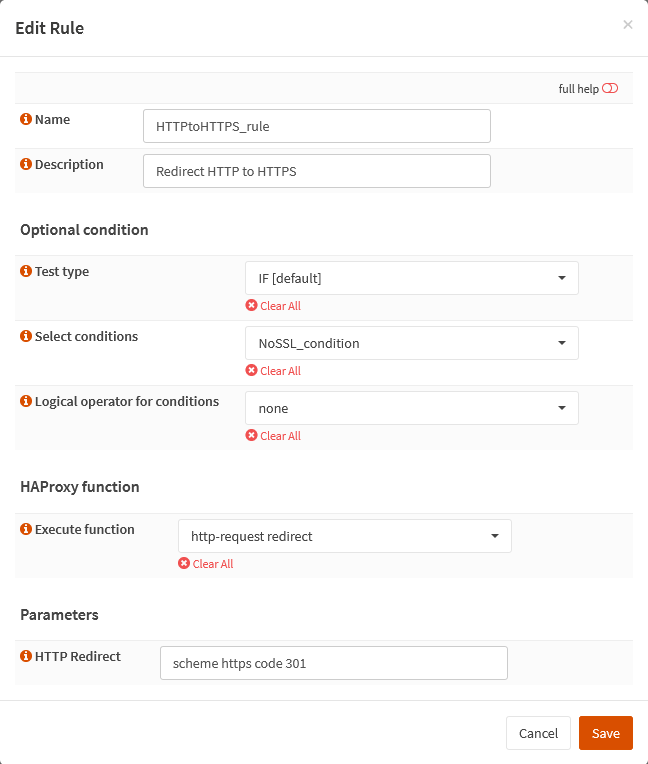
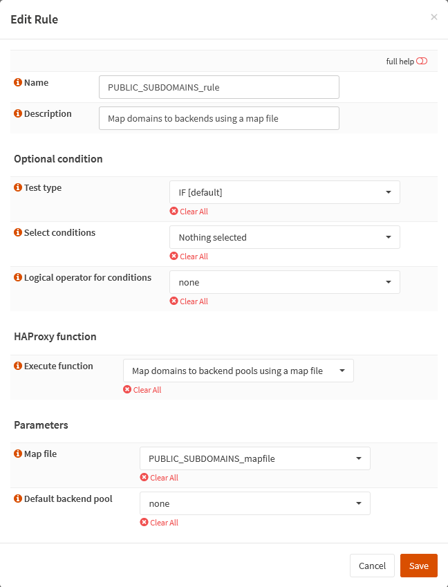

{{ $frontmatter.sectionTitle }}
# Part 5.8 - Rules

Here we add the rules that decide what to do with the traffic based on our map files (or conditions if necessary).

The `HTTPtoHTTPS_rule` upgrades the HTTP connection to HTTPS so that the client connects to the `HTTPS_frontend` instead.

The `PUBLIC_SUBDOMAINS_rule` maps our subdomains to our backends using the map file we created in the previous step.

## Process - `HTTPtoHTTPS_rule`

In your OPNsense GUI, Preform the following;

- Navigate to **`Services --> HAProxy --> Settings --> Rules & Checks --> Rules`**  
  -> Create a new rule and assign the following settings.

```text
Name:                               HTTPtoHTTPS_rule
Description:                        Redirect HTTP to HTTPS

Test type:                          IF [default]
Select conditions:                  NoSSL_condition
Logical operator for conditions:    none
    
Execute function:                   http-request redirect

HTTP Redirect:                      scheme https code 301
```

## Process - `PUBLIC_SUBDOMAINS_rule`

In your OPNsense GUI, Preform the following;

- Navigate to **`Services --> HAProxy --> Settings --> Rules & Checks --> Rules`**  
  -> Create a new rule and assign the following settings.

```text
Name:                               PUBLIC_SUBDOMAINS_rule
Description:                        Map domains to backends using a map file

Test type:                          IF [default]
Select conditions:                  nothing selected
Logical operator for conditions:    none
    
Execute function:                   Map domains to backend pools using a map file

Map file:                           PUBLIC_SUBDOMAINS_mapfile
Default backend pool:               None      
```

## Reference



