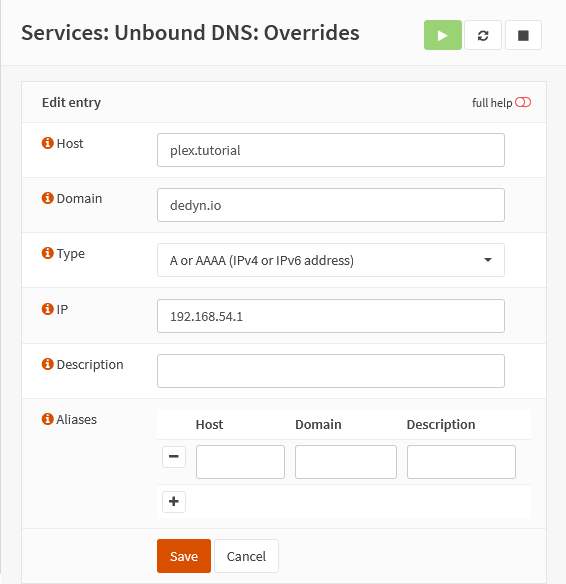

{{ $frontmatter.sectionTitle }}
# Part 6.A - Split DNS (DNS Overrides)

Since you are using OPNsense you are probably also using the Unbound DNS plugin as your local DNS server.
Because of that you can easily set up DNS overrides.

## Process

> [!WARNING]
> If you are using 2nd level subdomains `<your_service>.<your_subdomain>.dedyn.io` for you services. You will need to create a `Host Override` for each of your services
> 
> If you are running all of your services on your 1st level subdomain `<your_subdomain>.dedyn.io` than you will just need to override this one.

> [!NOTE] IP NOTE
> The IP address can be any LAN (or VLAN) interface IP of your OPNsense, I am using the LAN IP on which the `SNI_frontend` is also listening on because we set it to "0.0.0.0".

In your OPNsense GUI, Preform the following;

- Navigate to **`Services --> Unbound DNS --> Overrides`**  
  -> Create a host override and assign the following settings.

```text
Name:       plex.tutorial   <hostnames>
domain:     dedyn.io        <domain>
Type:       A or AAAA (IPv4 or IPv6 addresses)
IP:         192.168.54.1    <see note above>
```

Access from internal networks should now be working.

## Reference

