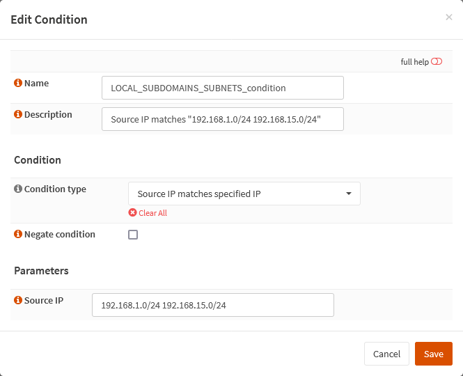
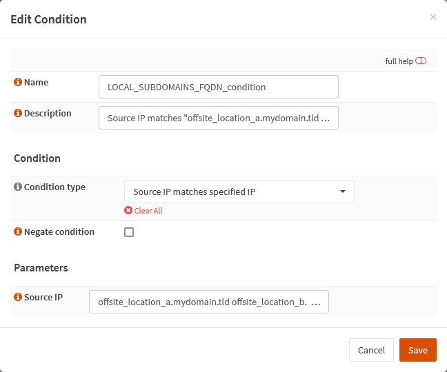

{{ $frontmatter.sectionTitle }}
# Part 7.2 - Conditions

Now you need a condition that detects if the source of the request is a local IP or a FQDN.

## Process - `LOCAL_SUBDOMAINS_SUBNETS_condition`

You can of course also use the predefined "Source IP is local" condition.

I am however using only specific subnets since the predefined condition is using the entire RFC1918 IP range, which I don't need!

In your OPNsense GUI, Preform the following;

- Navigate to **`Services --> HAProxy --> Settings --> Rules & Checks --> Conditions`**  
    -> Create a new condition and assign the following settings.

```text
Name:               LOCAL_SUBDOMAINS_SUBNETS_condition
Description:        Source IP matches <your_ip_blocks>

Condition type:     Source IP matches specified IP
Negate condition:   unchecked
 
Source IP:          192.168.1.0/24 192.168.15.0/24
```


## Process - `LOCAL_SUBDOMAINS_FQDN_condition` (optional)

As I just said you can also check for a FQDN.

But please keep in mind that HAProxy resolves those hostnames to their IPs and then checks them. But the resolving is only done once during the start / restart of HAProxy.

So if the IP of your FQDN is changing regularly this won't work very well, except if you restart your HAProxy using a cron job like every 24 hours or so.

In your OPNsense GUI, Preform the following;

- Navigate to **`Services --> HAProxy --> Settings --> Rules & Checks --> Conditions`**  
  -> Create a new condition and assign the following settings.

```text
Name:               LOCAL_SUBDOMAINS_FQDN_condition
Description:        Source IP matches <your_domain_list>

Condition type:     Source IP matches specified IP
Negate condition:   unchecked
 
Source IP:          offsite_location_a.mydomain.tld offsite_location_b.mydomain.tld
```

## Reference



