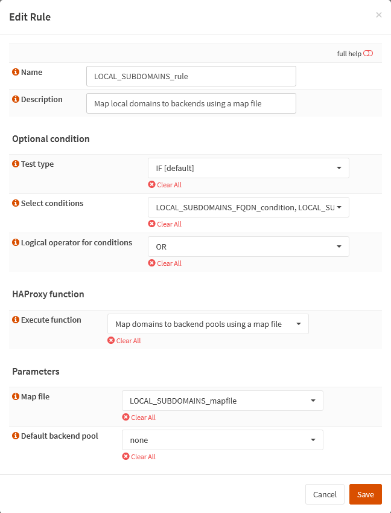

{{ $frontmatter.sectionTitle }}
# Part 7.3 - Rules

Here you need to clone the `PUBLIC_SUBDOMAINS_rule`, rename it to `LOCAL_SUBDOMAINS_rule`, select your `LOCAL_SUBDOMAINS_SUBNETS_condition` and select your `LOCAL_SUBDOMAINS_mapfile`.

## Process

> [!NOTE] FQDN condition
> If you are also using a FQDN condition, like I do, you will need to select both your FQDN and your subnet condition together with the logical `or` operator!

In your OPNsense GUI, Preform the following;

- Navigate to **`Services --> HAProxy --> Settings --> Rules & Checks --> Rules`**  
    -> Clone the `PUBLIC_SUBDOMAINS_rule` and assign the following settings.

```text
Name:                               Local_SUBDOMAINS_rule
Description:                        Map local domains to backends using a map file

Test type:                          IF [default]
Select conditions:                  LOCAL_SUBDOMAINS_SUBNETS_condition <LOCAL_SUBDOMAINS_FQDN_condition>
Logical operator for conditions:    OR // [!code warning]
    
Execute function:                   Map domains to backend pools using a map file

Map file:                           LOCAL_SUBDOMAINS_mapfile
Default backend pool:               None      
```

## Reference

